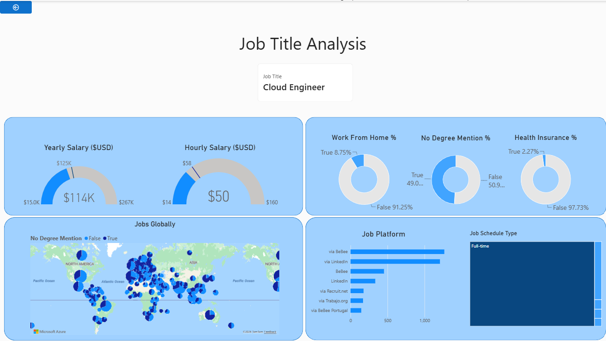
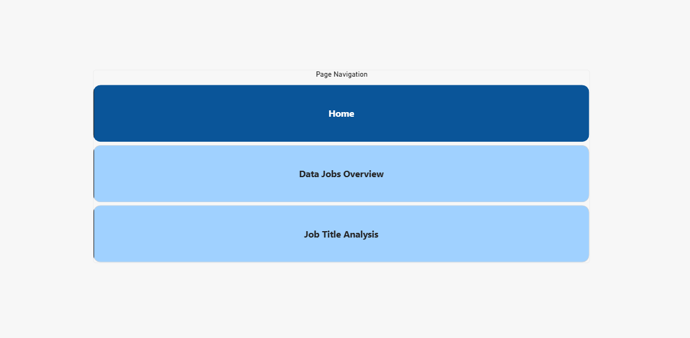

# Data Jobs Analysis

## Interactive Power BI Report

[View the interactive Power BI report](https://app.powerbi.com/view?r=eyJrIjoiMmRjOGQ1ZmQtM2Y4ZS00NmZhLTk4Y2QtYWVlY2EyMDY0MmYxIiwidCI6IjMyMzNmZmExLWVhMDUtNDQ0NS04OTU4LTZiNjc0NDcyMzE0NyJ9)

## Project Overview

This project explores the data jobs market using job posting data, with a focus on job demand, salary, job characteristics, work arrangements, and geographic distribution.

The report was developed in Power BI to turn job posting data into an interactive dashboard that allows users to explore overall market patterns and investigate individual job titles.

## Questions This Analysis Explores

This analysis explores the following questions about the data jobs market:

- Which data-related job titles have the highest number of job postings?
- How did data job posting volume change during 2024?
- What are the typical yearly and hourly salaries for data-related jobs?
- How do hourly and yearly salaries relate to each other?
- How does salary vary across different job titles?
- For a selected job title, how common are work-from-home opportunities?
- How often do job postings mention degree requirements?
- How often do job postings include health insurance?
- Which job platforms have the most postings for a selected job title?
- What types of work schedules are most common?
- Where are job opportunities for a selected job title geographically distributed?
- What does the overall job posting profile look like for a specific data-related job title?

## Dashboard Preview

### Data Jobs Overview


The main dashboard provides an overview of the data jobs market, including:

- Total number of job postings
- Average job rating
- Median yearly salary
- Median hourly salary
- Job posting trends during 2024
- Job counts by job title
- Relationship between hourly and yearly salaries
- Detailed job posting information
- Job title drill-through analysis

### Job Title Analysis



This page provides a detailed analysis of a selected job title, including:

- Yearly salary
- Hourly salary
- Work-from-home availability
- Degree requirements
- Health insurance availability
- Job platform distribution
- Job schedule type
- Geographic distribution of job postings

### Home



The Home page provides navigation between the main sections of the report.

## How to Use

1. Open the [interactive Power BI report](https://app.powerbi.com/view?r=eyJrIjoiMmRjOGQ1ZmQtM2Y4ZS00NmZhLTk4Y2QtYWVlY2EyMDY0MmYxIiwidCI6IjMyMzNmZmExLWVhMDUtNDQ0NS04OTU4LTZiNjc0NDcyMzE0NyJ9).
2. Start on the **Data Jobs Overview** page to explore overall job demand, salary, and posting trends.
3. Use the **Job Title** slicer to filter the analysis to a specific job title.
4. Open **Job Title Analysis** to explore the selected job title in more detail.
5. Explore salary, work-from-home availability, degree requirements, health insurance, job platforms, schedule types, and geographic distribution.
6. Use the drill-through option from the overview page to investigate a selected job title.

## Key Analysis Areas

### Job Demand

The dashboard compares job posting volume across different data-related job titles and shows how job posting volume changed during 2024.

### Salary Analysis

Salary information is analyzed using median yearly and hourly salaries. The report also compares salary levels across job titles and examines the relationship between hourly and yearly compensation.

### Job Requirements and Benefits

The analysis includes indicators for:

- Degree requirements
- Health insurance
- Work-from-home availability

These variables provide additional context about job characteristics beyond salary.

### Job Platforms and Schedule Types

The report shows where jobs are posted and how they are structured, including job platforms and schedule types.

### Geographic Distribution

The Job Title Analysis page includes a map to explore the geographic distribution of postings for the selected job title.

## Power BI Skills Demonstrated

- Data cleaning and preparation
- Data modeling
- DAX measures
- Calculated columns
- Slicers and filters
- KPI cards
- Interactive charts
- Drill-through pages
- Geographic visualization
- Dashboard navigation
- Interactive report design

## Report Structure

The final portfolio version contains three main pages:

1. **Home**  
   Navigation page for the report.

2. **Data Jobs Overview**  
   Main dashboard covering job demand, salary, trends, and job posting details.

3. **Job Title Analysis**  
   Detailed analysis of an individual job title, including salary, requirements, benefits, platforms, schedules, and location.

## Files

```text
Data-Jobs-PowerBI/
├── README.md
├── Data_Jobs_Analysis.pbix
├── Home.png
├── Data_Jobs_Overview.png
└── Job_Title_Analysis.png
```

## Tools

- Power BI
- DAX
- Data visualization
- Data modeling
- Data analysis

## Project Goal

The goal of this project is to demonstrate how job market data can be transformed into an interactive Power BI report that supports exploration of job demand, salary, job characteristics, and geographic patterns.

The report combines multiple visualizations and interactive features to allow users to move from an overall view of the data jobs market to a more detailed analysis of individual job titles.
