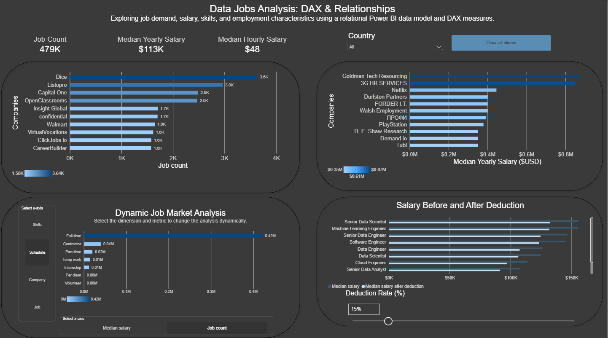
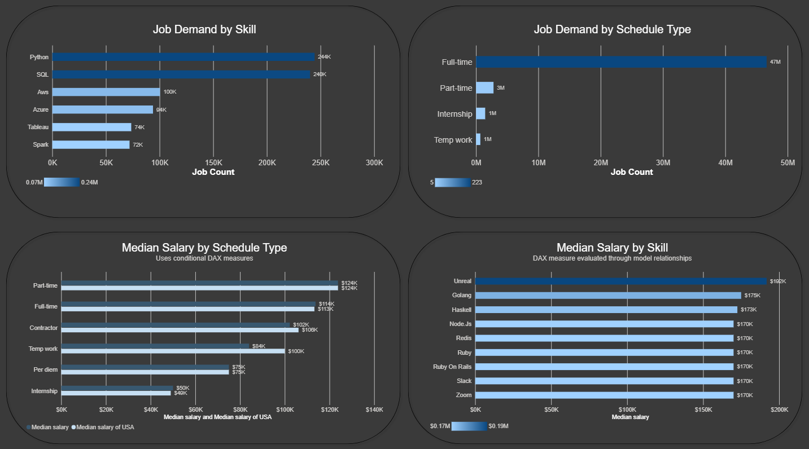
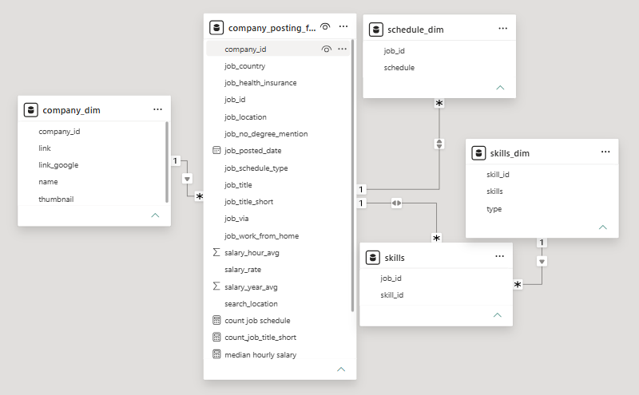

# Data Jobs Analysis: DAX & Relationships

## Interactive Power BI Report

[View the interactive Power BI report](https://app.powerbi.com/view?r=eyJrIjoiMWQ1ZTVkMmUtMGNhYS00MzkwLTllMWUtNjBkNjZiZWFlNGVkIiwidCI6IjMyMzNmZmExLWVhMDUtNDQ0NS04OTU4LTZiNjc0NDcyMzE0NyJ9)

## Project Overview

This project explores job demand, salary, skills, companies, and employment characteristics using a relational Power BI data model and DAX measures.

The project was designed to demonstrate how Power BI relationships and DAX can be used to build interactive analysis from job-posting data.

The report combines company, schedule, and skill dimensions with job-posting data and uses DAX measures, conditional calculations, dynamic analysis, and interactive filters.

## Questions This Analysis Explores

This analysis explores the following questions:

- How many job postings are associated with each company?
- Which companies have the highest median yearly salary?
- How does job demand vary across different skills?
- How does job demand vary across employment schedule types?
- How does median salary vary across schedule types?
- How does median salary vary across skills?
- How does median salary in the United States compare with overall median salary across schedule types?
- How does salary change when a different deduction rate is applied?
- How can DAX measures dynamically change an analysis based on the selected dimension and metric?
- How can relationships between job postings, skills, schedules, and companies be used to analyze job-market data?

## Report Preview

### Company Analysis



The main page provides an overview of company-level job demand and salary analysis.

It includes:

- Job Count
- Median Yearly Salary
- Median Hourly Salary
- Job count by company
- Median yearly salary by company
- Country filtering
- Dynamic job-market analysis
- Salary before and after deduction

The dynamic analysis allows the user to change the dimension and metric used in the visual.

### DAX & Relationships



This page focuses on DAX measures and relationship-based analysis.

It includes:

- Job demand by skill
- Job demand by schedule type
- Median salary by schedule type
- Median salary by skill
- Conditional DAX measures
- Measures evaluated through model relationships

## Data Model

The report uses a relational data model with a central job-posting table and supporting dimension and skill tables.



The model includes tables such as:

- `company_dim`
- `company_posting_fact`
- `schedule_dim`
- `skills`
- `skills_dim`

The relationships allow measures based on the job-posting data to be analyzed by company, schedule type, and skill.

## Key Analysis Areas

### Company Analysis

The report compares job posting counts and median yearly salary across companies. A country slicer allows the analysis to be filtered by country.

### Skill Demand

The DAX analysis compares job counts across skills to identify differences in skill demand within the job-posting dataset.

### Schedule Analysis

Job demand and median salary are analyzed across different employment schedule types, including full-time, part-time, internship, contractor, and other schedules represented in the data.

### Conditional Salary Analysis

The report compares median salary with median salary for the United States across schedule types using conditional DAX measures.

### Salary by Skill

The report evaluates median salary by skill using the relationships in the data model.

### Dynamic Analysis

The report includes a dynamic analysis where the user can select the dimension and metric used in the visual. This demonstrates the use of dynamic Power BI functionality together with DAX.

### Salary Deduction Analysis

The report includes a deduction-rate control that allows users to compare median salary before and after applying a selected deduction rate.

## DAX and Power BI Techniques Demonstrated

- DAX measures
- Conditional DAX measures
- Measures using filter context
- Relationship-based calculations
- Dynamic analysis
- Field parameters
- Interactive slicers
- KPI cards
- Data modeling
- Dimension and fact table relationships
- Interactive charts
- Comparative salary analysis
- Dashboard design

## How to Use

1. Open the Power BI report.
2. Start on the **Company Analysis** page to explore overall company, salary, and job-demand information.
3. Use the **Country** slicer to filter the analysis.
4. Explore the **Dynamic Job Market Analysis** visual and change the selected dimension and metric.
5. Use the **Deduction Rate** control to compare salary before and after applying a deduction.
6. Open **DAX & Relationships** to explore skill and schedule analysis.
7. Review the data model to understand how the tables are connected.

## Report Structure

The report contains two main pages:

1. **Company Analysis**  
   Company-level job demand, salary analysis, dynamic analysis, and deduction analysis.

2. **DAX & Relationships**  
   Skill and schedule analysis demonstrating DAX measures and calculations through model relationships.

The GitHub repository also includes a screenshot of the Power BI data model to show the underlying table relationships.

## Files

```text
PowerBI-DAX-Relationships/
├── README.md
├── Data_Jobs_DAX_Relationships.pbix
├── Company_Analysis.png
├── DAX_and_Relationships.png
└── Data_Model.png
```

## Tools

- Power BI
- DAX
- Data modeling
- Data visualization
- Interactive dashboards
- Field parameters
- Slicers

## Project Goal

The goal of this project is to demonstrate how a relational Power BI data model can be combined with DAX measures to create interactive job-market analysis.

The project focuses on the connection between the underlying data model, table relationships, DAX calculations, and the final visual analysis.
