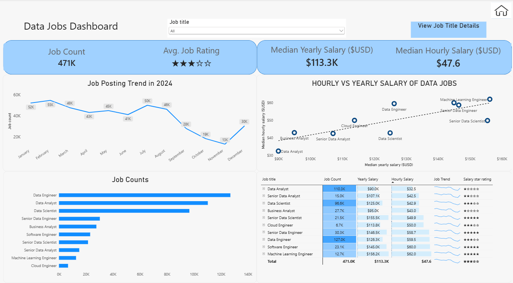

# Data Jobs Analysis

## Interactive Power BI Report

[View the interactive Power BI report](https://app.powerbi.com/view?r=eyJrIjoiMmRjOGQ1ZmQtM2Y4ZS00NmZhLTk4Y2QtYWVlY2EyMDY0MmYxIiwidCI6IjMyMzNmZmExLWVhMDUtNDQ0NS04OTU4LTZiNjc0NDcyMzE0NyJ9)

## Project Overview

This Power BI project analyzes a large dataset of data-related job postings. The report focuses on job demand, salary levels, job titles, work arrangements, job requirements, and hiring platforms.

The project demonstrates data analysis and visualization using Power BI, with interactive filters, dashboard navigation, and drill-through analysis.

## Dashboard Preview

### Data Jobs Overview



The main dashboard provides an overview of:

- Total number of job postings
- Average job rating
- Median yearly salary
- Median hourly salary
- Job posting trends during 2024
- Job counts by job title
- Relationship between hourly and yearly salaries
- Detailed job posting information
- Job title drill-through analysis

### Job Title Analysis


This page provides a detailed analysis of a selected job title, including:

- Yearly salary
- Hourly salary
- Work-from-home availability
- Degree requirements
- Health insurance availability
- Job platform distribution
- Job schedule type
- Geographic distribution of job postings

### Home


The Home page provides navigation between the main sections of the report.

## Key Analysis Areas

### Job Demand

The dashboard compares job posting volume across different data-related job titles and shows job posting trends over time.

### Salary Analysis

Salary information is analyzed using median yearly and hourly salaries. The report also compares salary levels across job titles and examines the relationship between hourly and yearly compensation.

### Job Requirements and Benefits

The analysis includes indicators for:

- Degree requirements
- Health insurance
- Work-from-home availability

### Job Platforms and Schedule Types

The report shows where jobs are posted and how they are structured, including job platforms and schedule types.

## Power BI Skills Demonstrated

- Data cleaning and preparation
- Data modeling
- DAX measures
- Calculated columns
- Slicers and filters
- KPI cards
- Interactive charts
- Drill-through pages
- Geographic visualization
- Dashboard navigation
- Interactive report design

## Report Structure

The final portfolio version contains three main pages:

1. **Home**  
   Navigation page for the report.

2. **Data Jobs Overview**  
   Main dashboard covering job demand, salary, trends, and job posting details.

3. **Job Title Analysis**  
   Detailed analysis of an individual job title, including salary, requirements, benefits, platforms, schedules, and location.

## Files

```text
Data-Jobs-PowerBI/
├── README.md
├── Data_Jobs_Analysis.pbix
├── Home.png
├── Data_Jobs_Overview.png
└── Job_Title_Analysis.png
```

## Tools

- Power BI
- DAX
- Data visualization
- Data modeling
- Data analysis

## Purpose

This project is part of my data analytics portfolio and demonstrates how I use Power BI to transform job market data into an interactive report that can be explored through filters, drill-through analysis, and visual dashboards.
